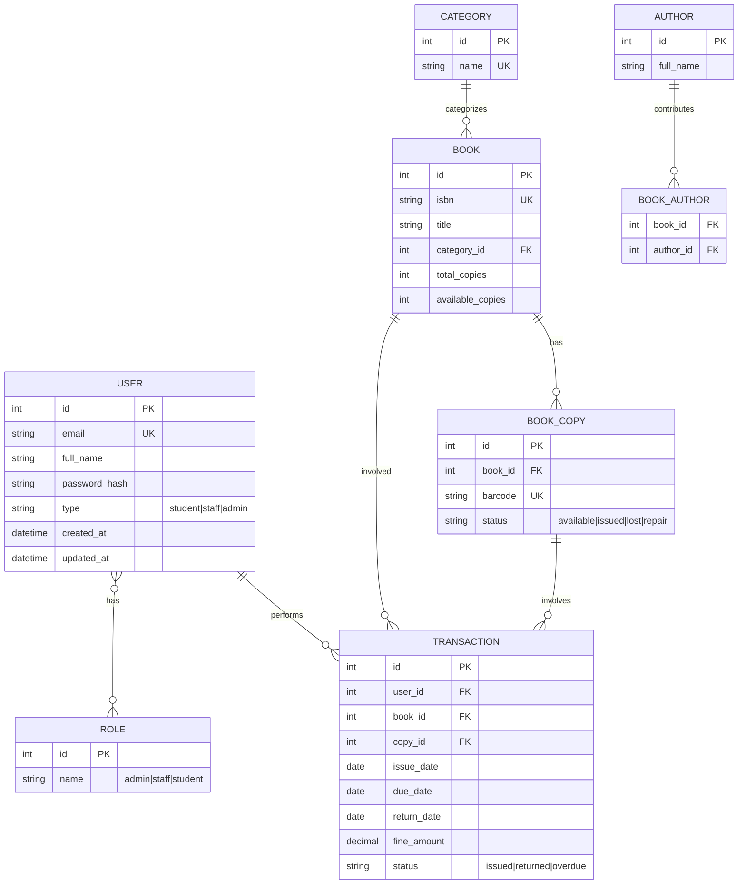

### ER Diagram (Mermaid)

```mermaid
erDiagram
  USER ||--o{ TRANSACTION : performs
  USER }o--o{ ROLE : has

  ROLE {
    int id PK
    string name "admin|staff|student"
  }

  USER {
    int id PK
    string email UK
    string full_name
    string password_hash
    string type "student|staff|admin"
    datetime created_at
    datetime updated_at
  }

  CATEGORY ||--o{ BOOK : categorizes
  AUTHOR ||--o{ BOOK_AUTHOR : contributes
  BOOK ||--o{ BOOK_COPY : has
  BOOK ||--o{ TRANSACTION : involved
  BOOK_COPY ||--o{ TRANSACTION : involves

  CATEGORY {
    int id PK
    string name UK
  }

  AUTHOR {
    int id PK
    string full_name
  }

  BOOK {
    int id PK
    string isbn UK
    string title
    int category_id FK
    int total_copies
    int available_copies
  }

  BOOK_AUTHOR {
    int book_id FK
    int author_id FK
  }

  BOOK_COPY {
    int id PK
    int book_id FK
    string barcode UK
    string status "available|issued|lost|repair"
  }

  TRANSACTION {
    int id PK
    int user_id FK
    int book_id FK
    int copy_id FK
    date issue_date
    date due_date
    date return_date
    decimal fine_amount
    string status "issued|returned|overdue"
  }
```

Notes:
- `available_copies` is denormalized for quick listings; keep in sync via triggers or app logic.
- Fines are computed on return based on overdue days and rate.
